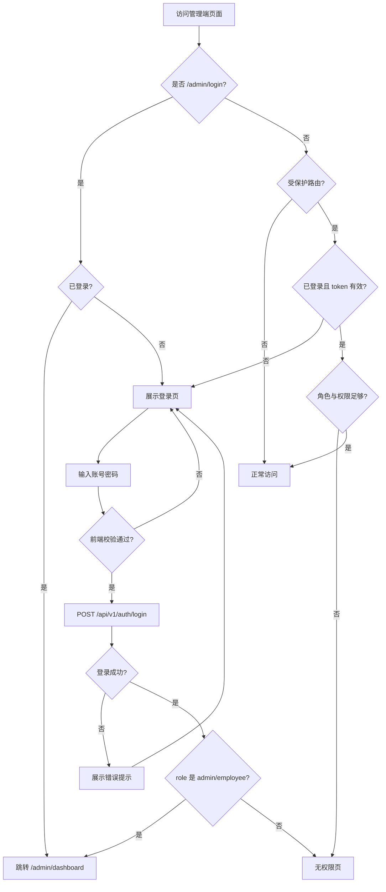

# 业务流程

## 1. 流程总览

```text
用户访问系统
  ↓
是否访问管理端受保护页面？
  ├─ 是 → 是否已登录？
  │         ├─ 否 → 跳转 /admin/login
  │         └─ 是 → 校验角色与权限 → 进入目标页面或展示无权限
  └─ 否 → 按页面策略处理（展示端可匿名浏览）
```

## 2. 管理端登录主流程

```text
打开 /admin/login
  ↓
展示登录页（左品牌区 + 右表单区）
  ↓
用户输入账号、密码，可选勾选「记住我」
  ↓
点击「登录」或按 Enter
  ↓
前端校验（账号、密码非空）
  ├─ 校验失败 → 展示字段错误提示，不请求接口
  └─ 校验通过 → 按钮 loading，调用 POST /api/v1/auth/login
        ↓
      后端校验账号密码与用户状态
        ├─ 失败 → 返回 401/403，前端展示对应提示
        └─ 成功 → 返回 access_token 与用户信息
              ↓
            前端保存登录态
              ↓
            按角色跳转
              ├─ admin / employee → /admin/dashboard
              └─ store_owner → 拒绝管理端访问，展示无权限或跳转 /
```

### 2.1 登录页入口与去向

| 端 | 登录入口 | 登录后默认去向 | 本期状态 |
|---|---|---|---|
| Web 管理端 | `/admin/login` | `/admin/dashboard` | 实现 |
| Web 展示端 | `/login` | `/` | 暂不开放 |
| 微信小程序 | — | 小程序首页 | 暂不实现 |

## 3. 路由鉴权流程

```text
用户访问管理端路由
  ↓
是否为 /admin/login？
  ├─ 是 → 是否已登录？
  │         ├─ 是 → 跳转 /admin/dashboard
  │         └─ 否 → 展示登录页
  └─ 否 → 是否受保护路由？
            ├─ 否 → 正常访问
            └─ 是 → 调用 GET /api/v1/auth/me 或校验本地 token
                      ├─ 未登录 / 过期 → 跳转 /admin/login，提示重新登录
                      ├─ 已登录但权限不足 → 展示无权限页
                      └─ 已登录且权限足够 → 正常访问
```

## 4. 角色分流规则

| 角色 | 标识 | 登录后默认页面 | 管理端访问 |
|---|---|---|---|
| 系统管理员 | `admin` | `/admin/dashboard` | 允许 |
| 企业内部员工 | `employee` | `/admin/dashboard` | 允许 |
| 瓷砖零售店店主 | `store_owner` | `/`（Web 展示端） | 拒绝 |

```text
登录成功，读取 user.role
  ↓
role in [admin, employee]？
  ├─ 是 → 进入管理端首页
  └─ 否（store_owner）→ 若当前为管理端上下文，拒绝并提示无权限
```

## 5. 退出登录流程

```text
用户在管理端点击「退出登录」
  ↓
调用 POST /api/v1/auth/logout（可选，视后端方案）
  ↓
清除本地 token / Cookie / auth store
  ↓
跳转 /admin/login
  ↓
再次访问受保护页面 → 触发路由守卫 → 停留登录页
```

## 6. 登录态保持流程

```text
用户勾选「记住我」并登录成功
  ↓
前端按策略保存 token（localStorage / sessionStorage / Cookie）
  ↓
用户刷新页面或重新打开浏览器
  ↓
前端读取本地登录态
  ├─ 有效 → 调用 GET /api/v1/auth/me 恢复用户信息，保持已登录状态
  └─ 无效或过期 → 清除本地态，跳转登录页
```

## 7. 异常与边界流程

### 7.1 登录失败

```text
提交登录
  ↓
后端返回错误
  ├─ 401 AUTH_INVALID_CREDENTIALS → 提示「账号或密码错误」
  ├─ 403 AUTH_USER_DISABLED → 提示「账号已停用，请联系管理员」
  ├─ 429 AUTH_TOO_MANY_ATTEMPTS → 提示登录过于频繁（若实现）
  └─ 网络错误 → 提示「网络异常，请稍后重试」
```

### 7.2 占位功能（本期）

```text
点击「忘记密码」→ 展示「功能建设中」或跳转占位页
点击「企业微信」→ 展示「功能建设中」或占位提示
点击「简体中文」→ 占位，不阻塞主流程
```

## 8. 后续扩展流程（本期不实现）

以下流程在 PRD 与原型中已预留，正式实现需单独 OpenSpec Change：

```text
忘记密码：输入标识 → 验证码 → 重置密码 → 返回登录页
企业微信：OAuth / 扫码 → 后端绑定校验 → 按角色跳转
小程序登录：微信授权 → 后端用户映射 → 进入小程序首页
```

## 9. 流程图（Mermaid）


