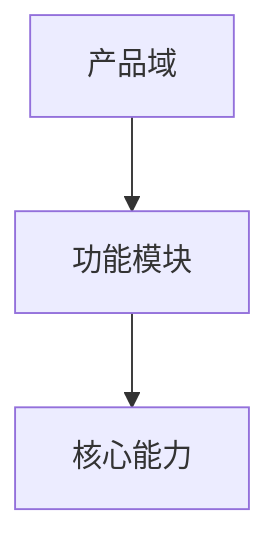

# 产品架构

> 产品：待填写｜基线版本：待填写｜状态：待填写｜更新日期：待填写

## 1. 架构目标与原则

## 2. 产品逻辑架构图

## 3. 产品域说明

| 产品域 ID | 名称 | 目标 | 责任边界 | 来源定位 ID |
| --- | --- | --- | --- | --- |
| 待填写 | 待填写 | 待填写 | 待填写 | 待填写 |

## 4. 模块与核心能力

| 模块 ID | 所属产品域 | 功能模块 | 能力 ID | 核心能力 | 能力边界 |
| --- | --- | --- | --- | --- | --- |
| 待填写 | 待填写 | 待填写 | 待填写 | 待填写 | 待填写 |

## 5. 系统内外边界

## 6. 依赖关系

| 依赖 ID | 来源对象 | 目标对象 | 依赖内容 | 影响 |
| --- | --- | --- | --- | --- |
| 待填写 | 待填写 | 待填写 | 待填写 | 待填写 |

## 7. 定位映射

